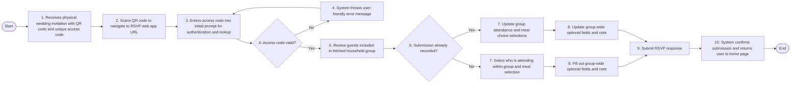
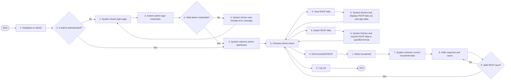

# Wedding RSVP App Requirements

## Project Summary

This project is a web-based RSVP system for wedding guests. The guests will access the web application via a link provided from a QR code. From the webpage, a unique access code will bring the guest to their specific household profile for RSVPing themselves along with other closely related guests. Users should be able to specify and submit RSVP details, such as meal choice and attendance, in a simple manner that is designed to prevent misuse, accidentally or maliciously, of the service.

## Goals

- Allows invited guests to RSVP online.
- Support "household" clustering of guests that are tightly related and will RSVP together.
- Prevents guests from submitting or updating RSVP information for other guests not assigned to their "household."
- Store RSVP responses reliably.
- Allow the wedding couple unique access to review and export guest RSVP responses.
- Keep system low-cost and easy to maintain.

## Non-Goals

- Guests will not create accounts on the web app.
- Guests will not assign passwords to their RSVP submission, only the pre-assigned access code.
- Online payment will never be available.
- Seat assignment options will not be available.
- No downloads/apps required to utilize the web app.

## Roles

### Wedding Guest

1. Receives the physical invitation.
2. Accesses RSVP web app.
3. Enters an individualized RSVP access code.
4. Reviews invited guests within their "household" group.
5. Submits required RSVP information.
6. Updates submitted RSVP information up until guest information is due.

### Admin

1. Views guest RSVP submissions.
2. Updates guest records as needed.
3. Exports RSVP data records.

## User Flow

### Wedding Guest Flow

### Admin Flow

## Functional Requirements

| FR # | Requirement | Completed? <Y/N> |
|---|---|---|
| FR-001 | The system shall allow a guest to access the RSVP page from a public URL. | |
| FR-002 | The system shall require an access code before displaying household RSVP details. | |
| FR-003 | The system shall display only the invited guests associated with the household access code. | |
| FR-004 | The system shall allow a guest to mark each invited person as attending or not attending. | |
| FR-005 | The system shall allow meal selection for attending guests. | |
| FR-006 | The system shall allow a guest to submit optional notes and fields. | |
| FR-007 | The system shall save time-dated RSVP submissions. | |
| FR-008 | The system shall allow an admin to view or export RSVP responses. | |
| FR-009 | The system shall allow an admin to update RSVP responses for a household. | |

## Security and Privacy Requirements

| SR # | Requirement | Completed? <Y/N> |
|---|---|---|
| SR-001 | The system shall not expose the full guest/household list publicly. | |
| SR-002 | The system shall require a household unique access code before showing household RSVP details. | |
| SR-003 | Access codes shall be difficult to guess. | |
| SR-004 | Invitation codes shall not be retained in plaintext. | |
| SR-005 | Admin dashboard shall not be accessible without proper admin authentication. | |
| SR-006 | The system shall only collect information necessary for RSVP. | |

## Data Requirements

### Household

1. Household ID `<String>`
2. Display name `<String>`
3. Access code hash `<String>`
4. RSVP submission status `<String>`
5. Guests `<List(String)>`
6. Submission timestamp `<String>`

### Guest

1. Guest ID `<String>`
2. Name `<String>`
3. Attendance Status `<String>`
4. Meal Choice `<String>`
5. Music suggestions `<List(String)>`
6. Note `<String>`

### RSVP Submission

1. Household ID `<String>`
2. Submitted responses `<List>`
3. Submitted at `<String>`
4. Last updated at `<String>`

## UX Requirements

| UX # | Requirement | Completed? <Y/N> |
|---|---|---|
| UX-001 | The web page shall be mobile-friendly. | |
| UX-002 | The RSVP process should be completable in 2 minutes. | |
| UX-003 | Error messages should be helpful and non-technical. | |
| UX-004 | Guests should receive clear confirmation upon RSVP submission. | |
| UX-005 | Access code entry shall be case-insensitive. | |

## Operational Requirements

| OR # | Requirement | Completed? <Y/N> |
|---|---|---|
| OR-001 | The web app shall be inexpensive to operate. | |
| OR-002 | Application errors shall be logged. | |
| OR-003 | The admin shall be able to recover RSVP data if needed. | |
| OR-004 | The web app shall have a basic backup or export plan. | |
| OR-005 | The system shall have a cost alert. | |

## Constraints

1. Invitations may be mass printed.
    - Unique QR codes may not be practical.
2. The system should be affordable as a personal project.
3. The system should be buildable and maintainable by one person.

## Edge Cases

- Guest incorrectly enters access code.
- Guest loses access code.
- Households with similar names.
- Guest wants to update RSVP information.
- Guest attempts to submit partial RSVP form.
- RSVP deadline has passed.
- Admin needs to update RSVP response.